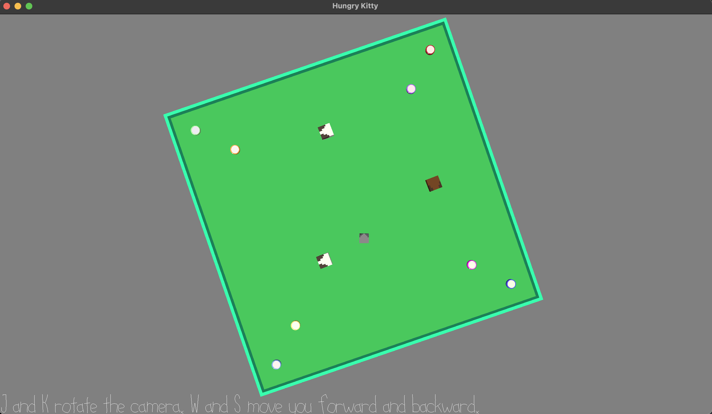

# Hungry Kitty

Author: Katherine Wang

Design: What's interesting about my game is that instead of traditional WASD controls, you can only move forward and backwards, and in order to move sideways, you must first rotate to that direction (which also rotates the camera). I also implemented custom collision logic.

Screen Shot:

How To Play:

You are a very hungry kitty. Fortunately, there are a lot of cans of cat food nearby. Unfortunately, there are a ton of dogs around too. Use the W and S keys to move forward and back and the J and K keys to rotate the camera to navigate to the food and satiate your hunger without getting run over by an excited doggy.

Sources: I made all my models in Blender.

This game was built with [NEST](NEST.md).

